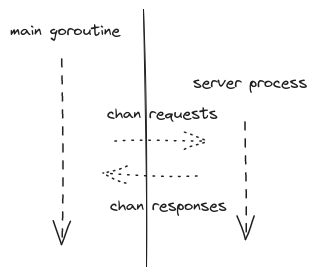
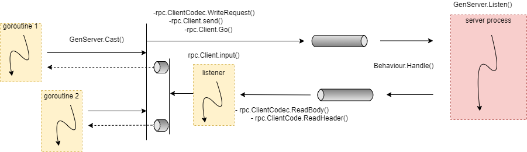

## Gen Server

- [The basic idea](#the-basic-idea)
- [How to create a *server process*](#how-to-create-a-server-process)
- [How to communicate with a *server process*](#how-to-communicate-with-a-server-process)
- [How to implement *genserver.Behaviour*](#how-to-implement-genserverbehaviour)
- [Under the hood](#under-the-hood)

### The basic idea

Inspired by Erlang's **gen_server** module.

**genserver** represents a set of abstractions and concrete implementations of parts of code necessary for writing *server processes*.

**Server process** is an informal name for a dedicated concurrency unit that runs for an extended period and listens for incoming requests from other concurrency units.

Let's say requires in-memory storage to manage settings, sessions, or something else. It must support simultaneous access by N concurrency units (i.e., be thread-safe).

#### Shared Memory & Locks

One possible solution is to use a shared memory model by writing a structure that utilizes a *hash table* and a concurrency primitive such as a *read-write lock*.

#### Message passing

In Erlang, where you do not have access to shared memory, a primary solution is to create a separate concurrency unit that handles requests, modifies its internal state, and sends responses. This corresponds to what is described above as a *server process*.


In Erlang, the unit of concurrency is the lightweight process. These processes do not share memory and communicate using *asynchronous message passing*. In Go, the unit of concurrency is the *goroutine*. To reproduce asynchronous message communication in Go, this project uses *buffered channels*.



### How to create a *server process*

1) define a server that embeds `genserver.GenServer`.

```golang
type SettingsServer struct {
    genserver.GenServer

    // define state
}
```

2) implement the `genserver.Behaviour`  contract

```golang
func (s *SettingsServer) Handle(serviceMethod string, seq uint64, body any) (any, error) {
    panic("not implemented")
}
```

3) write a factory function

```golang
func NewSettingsServer(/* state */) *SettingsServer {
	return Listen(func(genserv GenServer) *SettingsServer {
		return &SettingsServer{GenServer: genserv, /* state */ }
	})
}
```

### How to communicate with a *server process*

For communication with a *server process*, `genserver.GenServer` provides two methods: `Cast` and `Call`.

1. *Cast* - a non-blocking request to a *server process*. This method remains non-blocking as long as the buffered channel of the server process has enough free slots.

```golang
var host string
call := settings.Cast("get", "db.host", &host, nil)
<-call.Done // wait for result
```

2. `Call` - a blocking request to a *server process*.

```golang
var host string
err := settings.Call("get", "db.host", &host)
```

This method internally uses `GenServer.Cast` & `<-call.Done`.

Instead of directly using the *Cast* and *Call* methods, you can write your own API for *SettingsServer*. It's up to you whether the method is blocking or non-blocking. Typically, read operations are blocking and writes are non-blocking.

```golang
func (s *SettingsServer) GetSetting(name string) (string, error) {
    var host string
    err := s.Call("get", "db.host", &host, nil)
    return host, err
}
```

### How to implement `genserver.Behaviour`

The contract defines a single method, `Handle`. The parameters of this method receive values from the arguments passed to the *Cast* or *Call* methods.

```golang
call := settings.Cast("get", "db.host", &host, nil)

func (s *SettingsServer) Handle(serviceMethod string, seq uint64, body any) (any, error) {
    // serviceMethod - "get"
    // body - "db.host"
    // seq - unique identifier assigned to each request to a server process. 99.99% of the time just ignore it.
}
```

- DO NOT worry about locks or other synchronization primitives when modifying a *server process* state
- Avoid long-running operations inside the `Handle` method. This can cause a *server process* mailbox to overflow

Examples:
- [KVStoreServer](./tests/kvstore_server_test.go)
- [MathServer](./tests/math_server_test.go)

### Under the hood

Calls diagram

